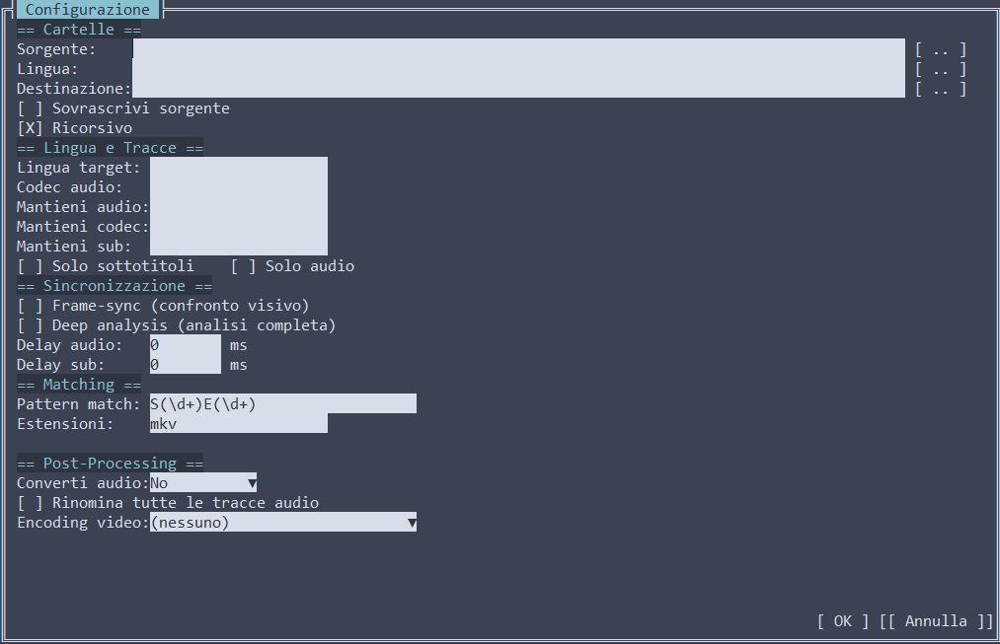
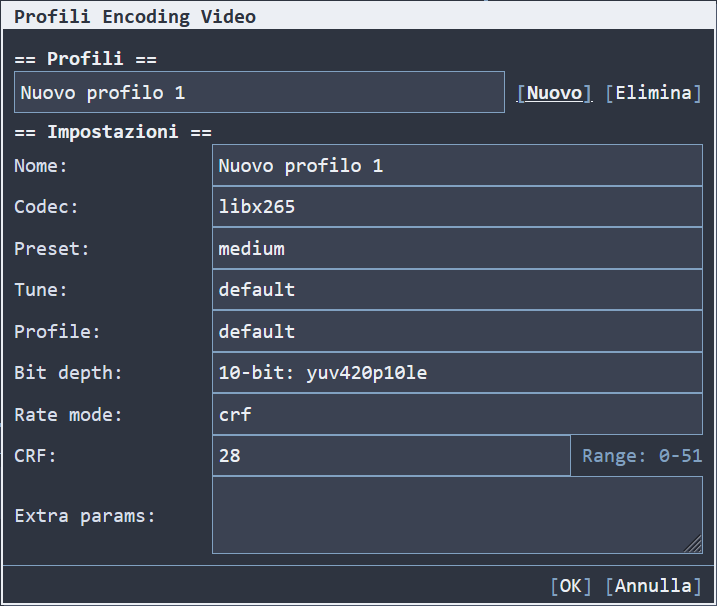
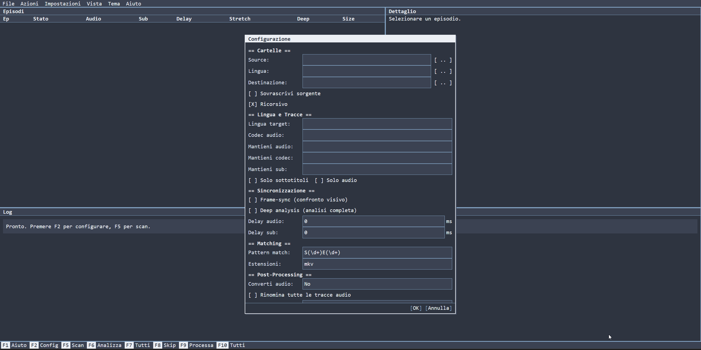

#  RemuxForge

Cross-platform application to merge audio tracks and subtitles from MKV files in different languages, with automatic synchronization between releases with different editing or speed.

Available in three modes: CLI (command line), TUI (terminal graphical interface) and WebUI (web interface).

## Key features

- Automatic merge of entire seasons with episode matching by filename
- Automatic synchronization: PAL/NTSC speed correction, frame-sync for constant offset, deep analysis for different edits
- Filter by language, audio codec, subtitles, both for import and for keeping from source
- Lossless audio conversion to FLAC or Opus during merge
- Post-merge video encoding with customizable profiles (x264, x265, SVT-AV1)
- Automatic GPU acceleration for video decoding during analysis phases
- Three interfaces: scriptable CLI, TUI with Terminal.Gui, WebUI for browser and headless servers
- Docker deployment with optional GPU support
- Graphical themes (8 themes for TUI, dark/light theme for WebUI)
- Persistent configuration in `appsettings.json` with auto-merge of new fields

## Requirements

- [MKVToolNix](https://mkvtoolnix.download/): mkvmerge must be in PATH or manually configured
- [ffmpeg](https://ffmpeg.org/): required for sync, audio conversion and video encoding. If missing, it can be automatically downloaded from Settings > Tool paths (the "Download" button)
- [mediainfo](https://mediainfo.sourceforge.net/): for detailed track reporting (optional)
- UTF-8 locale on Linux (required for filenames with non-ASCII characters)

**Platforms:**

| Platform | Architectures |
|----------|---------------|
| Windows | x64 |
| Linux | x64, ARM64 |
| macOS | x64, ARM64 |
| Docker | x64 (image with mkvtoolnix, ffmpeg and mediainfo preinstalled) |

## Installation and startup

### Desktop: CLI and TUI

Download the archive for your platform from the [release page](https://github.com/draknodd/RemuxForge/releases), extract and run.

- **Windows**: double click on `RemuxForge.exe` to open the TUI. For CLI, open a terminal and launch with parameters
- **Linux/macOS**: `chmod +x RemuxForge && ./RemuxForge` for the TUI. For CLI, launch with parameters

Launching without parameters opens the TUI. With parameters it runs in CLI mode.

### Desktop: WebUI

Download the WebUI archive from the [release page](https://github.com/draknodd/RemuxForge/releases), extract and run.

- **Windows**: double click on `RemuxForge.Web.exe`
- **Linux/macOS**: `chmod +x RemuxForge.Web && ./RemuxForge.Web`

Open `http://localhost:5000` in your browser. The port is configurable with the `REMUXFORGE_PORT` environment variable.

### Docker

> **Note:** the following examples need to be adapted to your own configuration. The volume paths, port, and especially the user mapping (`user`) must correspond to a user with read/write permissions on the mounted folders. If the specified user does not have access to the storage, the container will not work.

```bash
docker run -d \
  --name remuxforge \
  -p 5000:5000 \
  -e REMUXFORGE_PORT=5000 \
  -e REMUXFORGE_DATA_DIR=/data \
  -v /path/to/config:/data:rw \
  -v /path/to/media:/media:rw \
  draknodd/remuxforge:latest
```

**Docker Compose:**

```yaml
services:
  remuxforge:
    image: draknodd/remuxforge:latest
    container_name: remuxforge
    restart: unless-stopped
    user: "1000:1000"  # adapt to your own user (id -u / id -g)
    ports:
      - "5000:5000"
    environment:
      - REMUXFORGE_PORT=5000
      - REMUXFORGE_DATA_DIR=/data
    volumes:
      - /path/to/config:/data:rw        # configuration folder
      - /path/to/media:/media:rw         # video files folder
```

### Docker with GPU acceleration

Video decoding during analysis phases (speed correction, frame-sync, deep analysis) can be accelerated via GPU. ffmpeg uses `-hwaccel auto` and automatically selects the available backend in the container.

**NVIDIA (NVDEC):**

Requires the [NVIDIA Container Toolkit](https://docs.nvidia.com/datacenter/cloud-native/container-toolkit/latest/install-guide.html) installed on the host.

```bash
# Install nvidia-container-toolkit on the host
sudo apt-get install -y nvidia-container-toolkit
sudo nvidia-ctk runtime configure --runtime=docker
sudo systemctl restart docker

# Start the container with GPU access
docker run -d \
  --name remuxforge \
  --gpus all \
  -e NVIDIA_DRIVER_CAPABILITIES=compute,utility,video \
  -p 5000:5000 \
  -e REMUXFORGE_PORT=5000 \
  -e REMUXFORGE_DATA_DIR=/data \
  -v /path/to/config:/data:rw \
  -v /path/to/media:/media:rw \
  draknodd/remuxforge:latest
```

**Intel/AMD (VAAPI):**

```bash
docker run -d \
  --name remuxforge \
  --device /dev/dri:/dev/dri \
  -p 5000:5000 \
  -e REMUXFORGE_PORT=5000 \
  -e REMUXFORGE_DATA_DIR=/data \
  -v /path/to/config:/data:rw \
  -v /path/to/media:/media:rw \
  draknodd/remuxforge:latest
```

### Environment variables

| Variable | Description | Default |
|----------|-------------|---------|
| REMUXFORGE_PORT | WebUI HTTP port | 5000 |
| REMUXFORGE_DATA_DIR | Directory for configuration and data (.remux-forge) | Executable directory |
| REMUXFORGE_LOG_FILE | Log file path. When set, enables file logging | Not active |

## TUI Interface

Launching the application without parameters opens the graphical interface based on Terminal.Gui, organized in three panels: episode table, selected episode detail, real-time log. Menu bar at the top, status bar with shortcut keys at the bottom.


### Shortcut keys

| Key | Action |
|-----|--------|
| F1 | Guide |
| F2 | Open configuration |
| F5 | Scan folders and match episodes |
| F6 | Analyze selected episode |
| F7 | Analyze all pending episodes |
| F8 | Skip/Unskip selected episode |
| F9 | Merge selected episode |
| F10 | Merge all analyzed episodes |
| Enter | Episode context menu |
| Ctrl+Q | Exit |

### Context menu

Right-clicking on an episode (or pressing Enter) opens a context menu with the following options:

- **Delay**: edit the manual delay for the selected episode
- **MediaInfo source**: shows the full MediaInfo report for the source file
- **MediaInfo language**: shows the MediaInfo report for the language file
- **MediaInfo result**: shows the MediaInfo report for the resulting file (available after merge)

MediaInfo options are visible only if the mediainfo tool is configured and the corresponding file exists. The report shows all track information (codec, channels, bitrate, resolution, language, etc.) and can be copied to clipboard.

### Menu

- **File**: Configuration (F2), Exit (Ctrl+Q)
- **Actions**: Scan files (F5), Analyze selected (F6), Analyze all (F7), Skip/Unskip (F8), Process selected (F9), Process all (F10)
- **Settings**: Tool paths, Audio conversion, Encoding profiles, Advanced
- **View**: Pipeline (shows the sequence of operations that will be executed based on the current configuration: sync, conversion, merge, encoding)
- **Theme**: change graphical theme (8 themes)
- **Help**: Guide (F1), Info

### Configuration (F2)

The configuration dialog groups all processing options:



- **Folders**: Source, Language, Destination, with browse button for each. Checkbox for overwrite source and recursive search
- **Language and Tracks**: Target language, Audio codec, Keep source audio/codec/sub, Subtitles only, Audio only, Rename tracks
- **Synchronization**: Frame-sync (checkbox), Deep analysis (checkbox), Audio delay (ms), Sub delay (ms)
- **Advanced**: Match pattern (regex), File extensions, Convert audio (flac/opus), Encoding profile

### Settings menu

- **Tool paths**: Paths to mkvmerge, ffmpeg, mediainfo and temporary files folder. Tools are auto-detected at startup. ffmpeg can be downloaded directly from the interface
- **Audio conversion**: FLAC compression level and Opus bitrate per channel layout (mono, stereo, 5.1, 7.1)
- **Encoding profiles**: Manage video encoding profiles (add, edit, delete). Profiles are saved in appsettings.json
- **Advanced**: Algorithm thresholds and parameters for video sync, speed correction, frame-sync, deep analysis, track split. Each section has a Reset Defaults button



### Themes

8 themes available from the Theme menu:

| Nord (default) | DOS Blue |
|:-:|:-:|
|  |  |

| Matrix | Cyberpunk |
|:-:|:-:|
|  |  |

| Solarized Dark | Solarized Light |
|:-:|:-:|
|  |  |

| Cybergum | Everforest |
|:-:|:-:|
|  |  |

## WebUI Interface

Web interface accessible from a browser, ideal for headless servers, NAS or Docker deployments. It offers the same features as the TUI: configuration, scan, analysis, merge, tool settings, audio conversion, encoding profiles, advanced settings, pipeline view, themes and guide.



## CLI Interface

For command-line processing, scriptable and automatable.

```bash
RemuxForge -s "D:\Serie.ENG" -l "D:\Serie.ITA" -t ita -d "D:\Output" -fs
```

### Required parameters

| Short | Long | Description |
|-------|------|-------------|
| -s | --source | Folder with source MKV files |
| -t | --target-language | Language code of tracks to import (e.g.: ita). Separate with comma for multiple languages: ita,eng |

### Source

| Short | Long | Description |
|-------|------|-------------|
| -l | --language | Folder with MKV files to take tracks from. If omitted, uses the source folder |

### Output (mutually exclusive, one required)

| Short | Long | Description |
|-------|------|-------------|
| -d | --destination | Folder where resulting files will be saved |
| -o | --overwrite | Overwrite source files |

### Sync

| Short | Long | Description |
|-------|------|-------------|
| -fs | --framesync | Synchronization via visual frame comparison (scene-cut) |
| -da | --deep-analysis | Full analysis for files with different edits (mutually exclusive with -fs) |
| -ad | --audio-delay | Manual delay in ms for audio (added to frame-sync/speed if active) |
| -sd | --subtitle-delay | Manual delay in ms for subtitles |

Speed correction (stretch) is always automatic and requires no parameters.

### Filters

| Short | Long | Description |
|-------|------|-------------|
| -ac | --audio-codec | Audio codec to import from language file. Separate with comma: DTS,E-AC-3 |
| -so | --sub-only | Import only subtitles, ignore audio |
| -ao | --audio-only | Import only audio, ignore subtitles |
| -ksa | --keep-source-audio | Audio languages to KEEP in the source (others are removed) |
| -ksac | --keep-source-audio-codec | Audio codecs to KEEP in the source. Separate with comma: DTS,TrueHD |
| -kss | --keep-source-subs | Subtitle languages to KEEP in the source |
| -rt | --rename-tracks | Rename all audio tracks in the resulting file (see Track renaming section) |

### Matching

| Short | Long | Description | Default |
|-------|------|-------------|---------|
| -m | --match-pattern | Regex for episode matching | S(\d+)E(\d+) |
| -r | --recursive | Search in subfolders | active |
| -nr | --no-recursive | Disable recursive search | |
| -ext | --extensions | File extensions to search for. Separate with comma: mkv,mp4,avi | mkv |

### Conversion and encoding

| Short | Long | Description |
|-------|------|-------------|
| -cf | --convert-format | Convert lossless tracks: flac or opus. TrueHD Atmos and DTS:X excluded |
| -ep | --encoding-profile | Video encoding profile post-merge (defined in appsettings.json) |

### Other

| Short | Long | Description |
|-------|------|-------------|
| -n | --dry-run | Show what it would do without executing |
| -h | --help | Show built-in help |
| -mkv | --mkvmerge-path | Custom path to mkvmerge (default: searches PATH) |

## Synchronization

Releases of the same content can differ in playback speed, initial cut or internal editing. RemuxForge offers three synchronization systems, all based on visual analysis of video frames via ffmpeg. If a GPU is available, video decoding is automatically accelerated.

**Which method to use:**

| Situation | Method | Option | Notes |
|-----------|--------|--------|-------|
| Same release, only different language | None (direct merge) | | Tracks are already aligned |
| PAL vs NTSC (25 vs 23.976 fps) | Speed Correction | Automatic | Always active, requires no parameters |
| Constant offset (different intro, initial black) | Frame-Sync | -fs | Calculates a fixed delay valid for the entire file |
| Scenes cut or added in the middle of the video | Deep Analysis | -da | Generates cut-and-splice operations on the tracks |

Frame-Sync and Deep Analysis are mutually exclusive. Speed correction is always active and combines with both.

### Speed Correction (automatic)

Compensates for the difference between PAL (25 fps) and NTSC (23.976 fps) releases, common with European TV series and movies. In these situations the audio of one version is slightly faster than the other, and a direct merge would produce a growing desync over time.

Detection happens by comparing the FPS of the two files via mkvmerge. If the difference is negligible (less than 0.1%), it does not intervene. If a mismatch is detected, it proceeds with:

1. Extracts initial video frames from both files and converts them to low-resolution grayscale images
2. Identifies scene cuts (shot changes) in both files, which are identical in both versions regardless of language
3. Matches cuts between source and language to calculate the initial delay, compensating for drift caused by the speed difference
4. Verifies the result at 9 points distributed along the video (10%, 20%, ... 90%). For each point it extracts a short segment, finds local scene cuts and confirms the calculated delay is correct. At least 5 valid points out of 9 are required
5. Applies the correction factor via mkvmerge (time-stretching) to the imported audio and subtitle tracks, without re-encoding

If either file has variable frame rate (VFR), the correction is automatically skipped because the container's `default_duration` is unreliable.

### Frame-Sync

Calculates a fixed offset to realign tracks when source and language have the same FPS but a different initial cut (longer intro, seconds of black, different credits at the beginning).

Enabled with **-fs** from CLI or from the checkbox in TUI/WebUI configuration.

1. Extracts initial frames from both files (2 minutes from source, 3 from language)
2. Identifies scene cuts in both files
3. For each pair of cuts, calculates what the delay would be if they corresponded to the same moment. The delay that receives the most coherent "votes" is selected as the candidate
4. Verifies the candidate by comparing the visual signature around the cuts: if the frames before and after are similar between the two files, the match is confirmed
5. Confirms at 9 points along the video, like speed correction. At least 5 valid points out of 9 are required

Frame-Sync does not work if the differences are mid-episode (scenes cut or added in the middle). In that case, use Deep Analysis.

### Deep Analysis

Advanced synchronization for files with different editing: scenes added, removed or replaced between source and lang. Unlike Frame-Sync which calculates a fixed offset, Deep Analysis analyzes the entire video track and generates cut-and-splice operations on the audio and subtitle tracks.

Enabled with **-da** from CLI or from the checkbox in TUI/WebUI configuration. Mutually exclusive with Frame-Sync.

The algorithm operates in 5 phases:

1. **Global stretch**: detects the speed difference from the container metadata (default_duration)
2. **Scene extraction**: full scene cut analysis of both files via ffmpeg
3. **Matching**: matches scene cuts between the two files, detecting points where the offset changes (scenes added or removed)
4. **Refinement**: at transition points, recalculates the offset at the native frame rate resolution of the video
5. **Verification**: global alignment check at 30 points distributed throughout the video

For each misalignment point, it generates the necessary operations: insertion of silence where the source has extra content, removal of segments where the lang has extra content.

Audio codecs without ffmpeg encoder support (TrueHD, DTS-HD MA, DTS:X) cannot be processed with cut-and-splice and are imported with the initial delay only.

### Manual delay

The parameters **-ad** (audio delay) and **-sd** (subtitle delay) specify an offset in milliseconds that is **added** to the frame-sync or speed correction result. In the TUI/WebUI it is possible to set different delays per episode via the Enter key.

## Audio conversion

Converts lossless audio tracks to FLAC or Opus during merge. Enabled with **-cf flac** or **-cf opus** from CLI, or from the "Convert audio" field in TUI/WebUI configuration.

**Convertible codecs:** DTS-HD Master Audio, DTS-HD High Resolution, TrueHD, PCM, ALAC, MLP, FLAC.

**Excluded:** TrueHD Atmos and DTS:X because they contain spatial metadata that would be lost.

Conversion applies both to source tracks kept via **-ksa**/**-ksac** and to tracks imported from the language file (only if lossless). If the target format is FLAC and the track is already FLAC, conversion is skipped.

**Default bitrates:**

| Format | Setting | Default |
|--------|---------|---------|
| FLAC | Compression level (0-12) | 8 |
| Opus Mono | kbps | 128 |
| Opus Stereo | kbps | 256 |
| Opus 5.1 | kbps | 510 |
| Opus 7.1 | kbps | 768 |

Values are configurable in `appsettings.json` or from the **Settings > Audio conversion** menu in TUI/WebUI.

## Track renaming

When audio conversion is active (**-cf**), converted tracks are automatically renamed with a descriptive title that includes codec, channel layout, bit depth, sample rate and bitrate. This always happens, no additional options needed.

With the **-rt** flag (or the "Rename all audio tracks" checkbox in TUI/WebUI), renaming is extended to audio tracks that were not converted, both from the source file and the language file. Useful to normalize track names in the resulting file when the original files have inconsistent or missing names.

**Generated name format:**

| Type | Format | Example |
|------|--------|---------|
| Original track | `Codec Layout BitDepth/SampleRate` | `DTS 5.1 24bit/48kHz` |
| Converted to FLAC | `FLAC Layout BitDepth/SampleRate` | `FLAC 5.1 24bit/48kHz` |
| Converted to Opus | `Opus Layout SampleRate Bitrate` | `Opus 5.1 48kHz 510kbps` |

Channel layout is formatted as 1.0 (mono), 2.0 (stereo), 5.1, 7.1. Missing information is omitted.

## Video encoding

After the merge it is possible to re-encode the video with a custom encoding profile. Encoding happens in-place on the resulting file via ffmpeg: the video is re-encoded, audio and subtitles are copied without modification.

Enabled with **-ep "profile_name"** from CLI, or from the "Encoding profile" field in TUI/WebUI configuration.

Profiles are managed from the **Settings > Encoding profiles** menu in TUI/WebUI (add, edit, delete) and are saved in `appsettings.json`.

**Supported codecs:**

| Codec | Preset | CRF range | Rate control | Notes |
|-------|--------|-----------|--------------|-------|
| libx264 | ultrafast...placebo | 0-51 (default 23) | crf, bitrate | Supports 2-pass for bitrate |
| libx265 | ultrafast...placebo | 0-51 (default 28) | crf, bitrate | Supports 2-pass for bitrate |
| libsvtav1 | 0...13 | 0-63 (default 35) | crf, qp, bitrate | Film grain synthesis |

Encoding uses software encoders. GPU acceleration applies only to decoding during analysis/sync phases, not to encoding.

**Example profile:**

```json
{
  "Name": "x265_CRF24",
  "Codec": "libx265",
  "Preset": "medium",
  "Tune": "default",
  "Profile": "main10",
  "BitDepth": "10-bit: yuv420p10le",
  "RateMode": "crf",
  "CrfQp": 24,
  "Bitrate": 0,
  "Passes": 1,
  "FilmGrain": 0,
  "FilmGrainDenoise": false,
  "ExtraParams": ""
}
```

- **Name**: unique name, used to select the profile from CLI (`-ep "x265_CRF24"`)
- **Codec**: `libx264`, `libx265` or `libsvtav1`
- **Preset**: speed/quality. For x264/x265: from `ultrafast` to `placebo`. For svtav1: from `0` (slow) to `13` (fast)
- **Tune**: optimization for content type. For x264: `film`, `animation`, `grain`, etc. For svtav1: `0` (VQ), `1` (PSNR), `2` (SSIM). `default` for no tune
- **Profile**: encoder profile, x264/x265 only (`main`, `main10`, `high`, etc.). `default` for automatic
- **BitDepth**: bit depth and pixel format, e.g. `"10-bit: yuv420p10le"`. The part after `: ` is passed to ffmpeg as `-pix_fmt`
- **RateMode**: `crf` (constant quality), `qp` (svtav1 only), `bitrate` (target kbps)
- **CrfQp**: CRF or QP value depending on the rate mode
- **Bitrate**: target in kbps, used only with `RateMode: "bitrate"`
- **Passes**: `1` or `2`. 2-pass works only with x264/x265 in bitrate mode
- **FilmGrain**: film grain synthesis 0-50, svtav1 only
- **FilmGrainDenoise**: denoise before applying film grain, svtav1 only
- **ExtraParams**: additional ffmpeg parameters in free format, appended to the end of the command

## GPU acceleration

RemuxForge uses ffmpeg with `-hwaccel auto` to accelerate **video decoding** during analysis phases (speed correction, frame-sync, deep analysis). The GPU is used automatically if available, no configuration required.

| Backend | Platform | GPU |
|---------|----------|-----|
| NVDEC | Linux, Windows | NVIDIA |
| VAAPI | Linux | Intel, AMD |
| VideoToolbox | macOS | Apple Silicon, Intel |

**Video encoding** uses software encoders (libx264, libx265, libsvtav1). Hardware encoders such as NVENC, VAAPI encode or VideoToolbox encode are not supported.

**Docker:** to enable GPU acceleration in the container, see the [Docker with GPU acceleration](#docker-with-gpu-acceleration) section.

## Use Cases

**1. Add Italian dubbing to an English release**

```bash
RemuxForge -s "D:\Serie.ENG" -l "D:\Serie.ITA" -t ita -d "D:\Output" -fs
```

**2. Overwrite source files**

```bash
RemuxForge -s "D:\Serie.ENG" -l "D:\Serie.ITA" -t ita -o -fs
```

**3. Replace a lossy track with a lossless one**

The file already has Italian AC3 lossy. You want to replace it with DTS-HD MA from another release.

```bash
RemuxForge -s "D:\Serie" -l "D:\Serie.ITA.HDMA" -t ita -ac "DTS-HD MA" -ksa eng,jpn -d "D:\Output" -fs
```

With **-ksa eng,jpn** you keep only English and Japanese from the source. With **-ac "DTS-HD MA"** you only take the lossless track from the Italian release.

**4. Multilanguage remux from different releases**

Each step takes the previous output as source.

```bash
RemuxForge -s "D:\Film.US" -l "D:\Film.ITA" -t ita -d "D:\Temp1" -fs
RemuxForge -s "D:\Temp1" -l "D:\Film.FRA" -t fra -d "D:\Temp2" -fs
RemuxForge -s "D:\Temp2" -l "D:\Film.GER" -t ger -d "D:\Output" -fs
```

**5. Anime with non-standard naming**

Many fansubs use "- 05" instead of S01E05. With **-m** you specify a custom regex. With **-so** you take only subtitles.

```bash
RemuxForge -s "D:\Anime.BD" -l "D:\Anime.Fansub" -t ita -m "- (\d+)" -so -d "D:\Output" -fs
```

**6. Daily show with dates in the filename**

```bash
RemuxForge -s "D:\Show.US" -l "D:\Show.ITA" -t ita -m "(\d{4})\.(\d{2})\.(\d{2})" -d "D:\Output"
```

**7. Filter subtitles from the source**

The source has 10 subtitle tracks in useless languages. With **-kss** you keep only the ones you want.

```bash
RemuxForge -s "D:\Serie.ENG" -l "D:\Serie.ITA" -t ita -so -kss eng -d "D:\Output" -fs
```

**8. Anime: keep only Japanese audio and import eng+ita**

The trick **-kss und** discards all subtitles from the source because no track has language "und".

```bash
RemuxForge -s "D:\Anime.BD.JPN" -l "D:\Anime.ITA" -t eng,ita -ksa jpn -kss und -d "D:\Output" -fs
```

**9. Dry run on a complex configuration**

With **-n** verify matching and tracks without executing.

```bash
RemuxForge -s "D:\Serie.ENG" -l "D:\Serie.ITA" -t ita -ac "E-AC-3" -ksa eng -kss eng -d "D:\Output" -fs -n
```

**10. Keep only DTS tracks from the source**

```bash
RemuxForge -s "D:\Serie.ENG" -l "D:\Serie.ITA" -t ita -ksac DTS -d "D:\Output" -fs
```

**11. Keep only English lossless audio from the source**

By combining **-ksa** and **-ksac**, you keep only tracks matching both criteria.

```bash
RemuxForge -s "D:\Serie.ENG" -l "D:\Serie.ITA" -t ita -ksa eng -ksac "DTS-HDMA,TrueHD" -d "D:\Output" -fs
```

**12. Import multiple codecs from the language file**

```bash
RemuxForge -s "D:\Serie.ENG" -l "D:\Serie.ITA" -t ita -ac "E-AC-3,DTS" -d "D:\Output" -fs
```

**13. Single source: apply delay and filter tracks**

Without **-l**, the application uses the source folder as language too. Allows remuxing with filters and delays without a separate release.

```bash
RemuxForge -s "D:\Serie" -t ita -ksa jpn,eng -kss eng,jpn -ad 960 -sd 960 -o
```

**14. Convert lossless tracks to FLAC during merge**

```bash
RemuxForge -s "D:\Serie.ENG" -l "D:\Serie.ITA" -t ita -cf flac -d "D:\Output" -fs
```

**15. Convert lossless tracks to Opus keeping only English from source**

TrueHD Atmos and DTS:X tracks are kept intact.

```bash
RemuxForge -s "D:\Serie.ENG" -l "D:\Serie.ITA" -t ita -cf opus -ksa eng -d "D:\Output" -fs
```

**16. Merge + video encoding with x265 profile**

```bash
RemuxForge -s "D:\Serie.ENG" -l "D:\Serie.ITA" -t ita -ep "x265_CRF24" -d "D:\Output" -fs
```

**17. Merge + audio conversion + video encoding**

```bash
RemuxForge -s "D:\Serie.ENG" -l "D:\Serie.ITA" -t ita -cf flac -ep "svtav1_CRF30" -ksa eng -d "D:\Output" -fs
```

**18. Deep analysis for files with different scenes**

```bash
RemuxForge -s "D:\Serie.ENG" -l "D:\Serie.ITA" -t ita -d "D:\Output" -da
```

## Report

At the end of processing a summary report is displayed. In TUI/WebUI the detail is visible in the side panel for each episode.

From CLI the report shows 3 tables:

```
========================================
  Report Dettagliato
========================================

SOURCE FILES:
  Episode     Audio               Subtitles           Size
  ----------------------------------------------------------------
  01_05       eng,jpn             eng                 4.2 GB

LANGUAGE FILES:
  Episode     Audio               Subtitles           Size
  ----------------------------------------------------------------
  01_05       ita                 ita                 2.1 GB

RESULT FILES:
  Episode     Audio          Subtitles      Size      Delay       FrmSync   Deep      Speed     Merge
  ----------------------------------------------------------------------------------------------------
  01_05       eng,jpn,ita    eng,ita        4.3 GB    +150ms      -         3 ops     1250ms    12500ms
```

**Result Files columns:**
- **Delay**: offset applied to imported tracks
- **FrmSync**: frame-sync processing time (if active, otherwise "-")
- **Deep**: number of cut-and-splice operations generated by deep analysis (if active, otherwise "-")
- **Speed**: speed correction processing time (if active, otherwise "-")
- **Merge**: mkvmerge execution time

In dry run mode, Size and Merge show "N/A" because the merge is not executed.

## Audio codecs

When you specify **-ac** or **-ksac** to filter codecs, the matching is **EXACT**, not partial. Both support multiple comma-separated values.

If a file has both DTS (core) and DTS-HD MA, and you write **-ac "DTS"**, it takes ONLY the DTS core. If you want DTS-HD Master Audio, you must write **-ac "DTS-HDMA"**. If you want both: **-ac "DTS,DTS-HDMA"**.

Codec names are case-insensitive. If a codec is not recognized with direct lookup, a match without hyphens, spaces and colons is attempted.

**Dolby:**

| Codec | Alias | Description |
|-------|-------|-------------|
| AC-3 | AC3, DD | Dolby Digital, the classic lossy 5.1 |
| E-AC-3 | EAC3, DD+, DDP | Dolby Digital Plus, used for lossy Atmos on streaming |
| TrueHD | TRUEHD | Dolby TrueHD, lossless, used for Atmos on Blu-ray |
| MLP | | Meridian Lossless Packing (TrueHD base) |
| ATMOS | | Special alias: matches both TrueHD and E-AC-3 |

**DTS:**

| Codec | Alias | Description |
|-------|-------|-------------|
| DTS | | DTS Core/Digital Surround only (does NOT match DTS-HD) |
| DTS-HD | | Matches both DTS-HD Master Audio and DTS-HD High Resolution |
| DTS-HD MA | DTS-HDMA | DTS-HD Master Audio, lossless |
| DTS-HD HR | DTS-HDHR | DTS-HD High Resolution |
| DTS-ES | | DTS Extended Surround (6.1) |
| DTS:X | DTSX | Object-based, extension of DTS-HD MA |

**Lossless:**

| Codec | Alias | Description |
|-------|-------|-------------|
| FLAC | | Free Lossless Audio Codec |
| PCM | LPCM, WAV | Raw uncompressed audio |
| ALAC | | Apple Lossless |

**Lossy:**

| Codec | Alias | Description |
|-------|-------|-------------|
| AAC | HE-AAC | Advanced Audio Coding |
| MP3 | | MPEG Audio Layer 3 |
| MP2 | | MPEG Audio Layer 2 |
| Opus | OPUS | Opus (WebM) |
| Vorbis | VORBIS | Ogg Vorbis |

## Language codes

Language codes are ISO 639-2 (3 letters). The most common ones:

| Code | Language |
|------|----------|
| ita | Italian |
| eng | English |
| jpn | Japanese |
| ger / deu | German |
| fra / fre | French |
| spa | Spanish |
| por | Portuguese |
| rus | Russian |
| chi / zho | Chinese |
| kor | Korean |
| und | Undefined (unspecified language) |

If you mistype a code, the application suggests the correct one:

```
Lingua 'italian' non riconosciuta.
Forse intendevi: ita?
```

## Regex patterns for episode matching

The application uses captured groups from the regex to match files. Each group in parentheses is concatenated with "_" to create the unique episode ID.

| Format | Example file | Pattern |
|--------|--------------|---------|
| Standard | Serie.S01E05.mkv | S(\d+)E(\d+) |
| With dot | Serie.S01.E05.mkv | S(\d+)\.E(\d+) |
| Format 1x05 | Serie.1x05.mkv | (\d+)x(\d+) |
| Episode only | Anime - 05.mkv | - (\d+) |
| 3-digit episode | Anime - 005.mkv | - (\d{3}) |
| Daily show | Show.2024.01.15.mkv | (\d{4})\.(\d{2})\.(\d{2}) |

The pattern **S(\d+)E(\d+)** captures two groups (season and episode). For "S01E05" it creates the ID "01_05". Source and language files with the same ID are matched together.

## Configuration (appsettings.json)

All persistent settings are saved in `.remux-forge/appsettings.json`. The file is automatically created with default values. The `.remux-forge` folder is located in the executable's directory, or in the path specified by `REMUXFORGE_DATA_DIR`.

New fields added in subsequent updates are automatically merged without overwriting existing user values.

```json
{
  "Tools": {
    "MkvMergePath": "",
    "FfmpegPath": "",
    "MediaInfoPath": "",
    "TempFolder": ""
  },
  "Flac": {
    "CompressionLevel": 8
  },
  "Opus": {
    "Bitrate": {
      "Mono": 128,
      "Stereo": 256,
      "Surround51": 510,
      "Surround71": 768
    }
  },
  "Ui": {
    "Theme": "nord"
  },
  "EncodingProfiles": [],
  "Advanced": {
    "VideoSync": {
      "FrameWidth": 320,
      "FrameHeight": 240,
      "MseThreshold": 100.0,
      "MseMinThreshold": 0.05,
      "SsimThreshold": 0.55,
      "SsimMaxThreshold": 0.999,
      "NumCheckPoints": 9,
      "MinValidPoints": 5,
      "SceneCutThreshold": 50.0,
      "CutHalfWindow": 5,
      "CutSignatureLength": 10,
      "FingerprintCorrelationThreshold": 0.80,
      "MinSceneCuts": 3,
      "MinCutSpacingFrames": 24,
      "VerifySourceDurationSec": 10,
      "VerifyLangDurationSec": 15,
      "VerifySourceRetrySec": 20,
      "VerifyLangRetrySec": 30
    },
    "SpeedCorrection": {
      "AutoDetect": true,
      "SourceStartSec": 1,
      "SourceDurationSec": 120,
      "LangDurationSec": 180,
      "MinSpeedRatioDiff": 0.001,
      "MaxDurationDiffTelecine": 0.005
    },
    "FrameSync": {
      "MinDurationMs": 10000,
      "SourceStartSec": 1,
      "SourceDurationSec": 120,
      "LangDurationSec": 180,
      "MinValidPoints": 10
    },
    "DeepAnalysis": {
      "CoarseFps": 2.0,
      "DenseScanFps": 1.0,
      "DenseScanSsimThreshold": 0.5,
      "DenseScanMinDipFrames": 2,
      "LinearScanWindowSec": 3.0,
      "LinearScanConfirmFrames": 5,
      "VerifyDipSsimThreshold": 0.2,
      "ProbeMultiMarginsSec": [5.0, 15.0, 25.0],
      "ProbeMinConsistentPoints": 2,
      "OffsetProbeDurationSec": 3.0,
      "OffsetProbeDeltas": [1000, 2000, 3000, 4000, 5000, -1000, -2000, -3000, -4000, -5000],
      "OffsetProbeMinSsim": 0.7,
      "MinOffsetChangeMs": 500,
      "MinConsecutiveStable": 5,
      "SceneThreshold": 0.3,
      "MatchToleranceMs": 250,
      "WideProbeToleranceSec": 15.0,
      "SceneExtractTimeoutMs": 600000,
      "GlobalVerifyPoints": 30,
      "GlobalVerifyMinRatio": 0.80,
      "VerifyMseMultiplier": 3.0,
      "InitialOffsetRangeSec": 30,
      "InitialOffsetStepSec": 0.5,
      "InitialVotingCuts": 50
    },
    "TrackSplit": {
      "FfmpegTimeoutMs": 300000
    }
  }
}
```

**Sections:**

- **Tools**: executable paths and temporary files folder. Auto-detected at startup, editable from the Settings > Tool paths menu
- **Flac**: FLAC compression level (0 = fast, 12 = maximum compression)
- **Opus.Bitrate**: Opus bitrate in kbps per channel layout (range: 64-768)
- **Ui.Theme**: selected graphical theme. Valid themes: `dark`, `nord`, `dos-blue`, `matrix`, `cyberpunk`, `solarized-dark`, `solarized-light`, `cybergum`, `everforest`
- **EncodingProfiles**: array of video encoding profiles (see the Video encoding section)
- **Advanced**: synchronization algorithm parameters. Configurable from the Settings > Advanced menu, with a Reset Defaults button for each sub-section. Default values are calibrated for most cases, modify only if necessary

## Building from source

Requires .NET 10 SDK.

```bash
# Build CLI/TUI
dotnet build RemuxForge.Cli -c Release

# Build WebUI (requires libman for client-side libraries)
cd RemuxForge.Web && libman restore && cd ..
dotnet build RemuxForge.Web -c Release
```

**Publish as standalone executable (single file, compressed):**

```bash
# CLI/TUI
dotnet publish RemuxForge.Cli -c Release -r win-x64 --self-contained true
dotnet publish RemuxForge.Cli -c Release -r linux-x64 --self-contained true
dotnet publish RemuxForge.Cli -c Release -r linux-arm64 --self-contained true
dotnet publish RemuxForge.Cli -c Release -r osx-x64 --self-contained true
dotnet publish RemuxForge.Cli -c Release -r osx-arm64 --self-contained true

# WebUI
dotnet publish RemuxForge.Web -c Release -r win-x64 --self-contained true
dotnet publish RemuxForge.Web -c Release -r linux-x64 --self-contained true
dotnet publish RemuxForge.Web -c Release -r linux-arm64 --self-contained true
dotnet publish RemuxForge.Web -c Release -r osx-x64 --self-contained true
dotnet publish RemuxForge.Web -c Release -r osx-arm64 --self-contained true
```

**Docker:**

```bash
docker build -t remuxforge .
```
